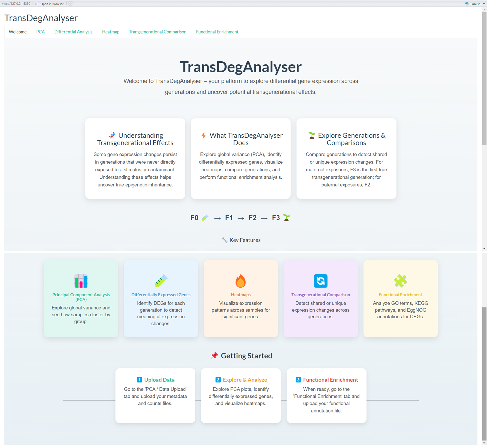
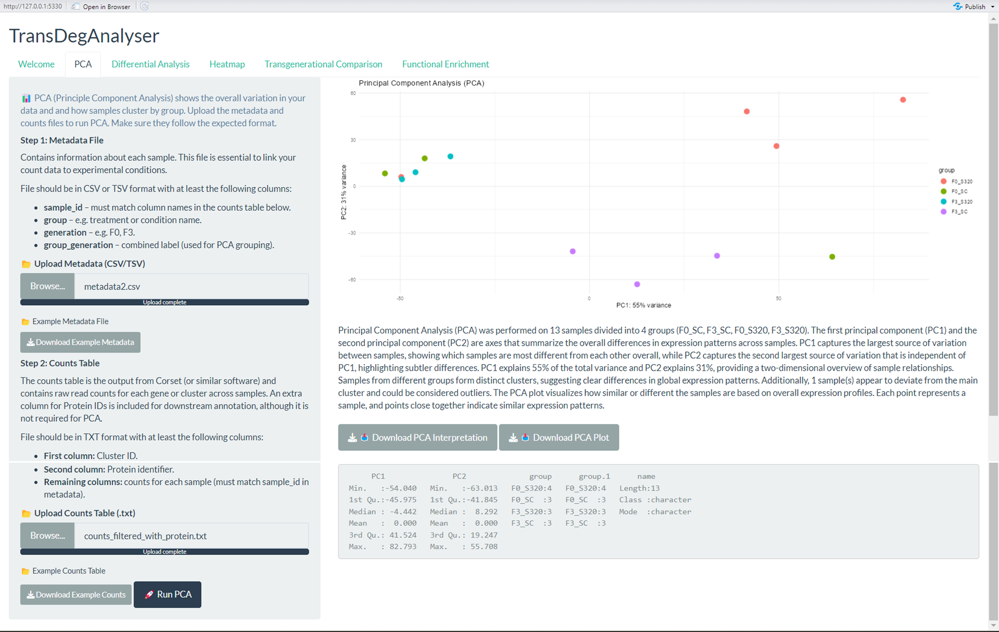
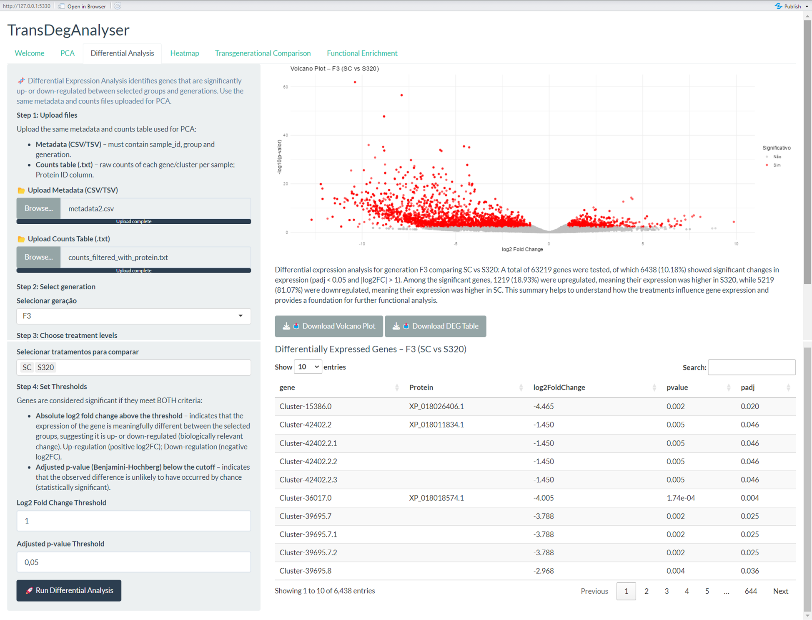
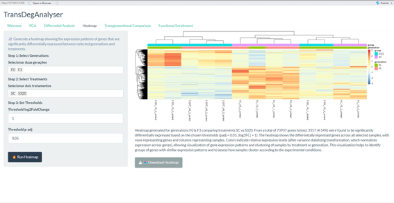
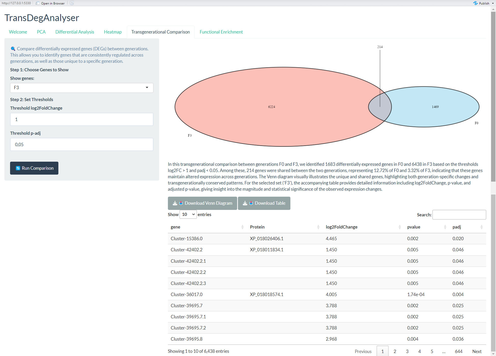
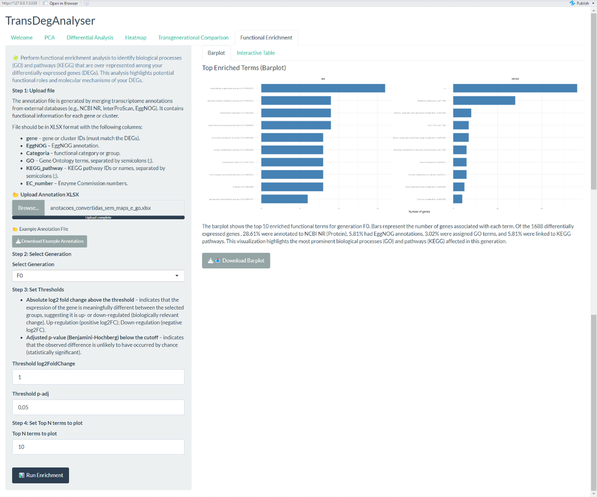
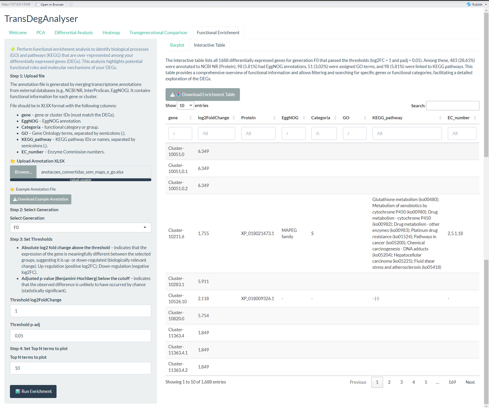

# Thesis_RNASeq

TransDegAnalyser: A Shiny App for Transgenerational Gene Expression Analysis
Overview
TransDegAnalyser is a user-friendly R Shiny application designed to perform comprehensive transcriptomic analysis, with a specific focus on identifying transgenerational gene expression effects. The application streamlines the entire analytical workflow, from initial data quality control and differential expression analysis to advanced visualization and functional interpretation.

The central goal of the app is to help researchers uncover persistent biological effects that are inherited across generations that were never directly exposed to an environmental stimulus.

Why Transgenerational Effects Matter?
In the context of a maternal exposure, the F3 generation is the first cohort to be truly "transgenerational," as it is derived from a germline that has never been directly exposed to the original stimulus. Conversely, for a paternal exposure, this is the F2 generation. Identifying and analyzing gene expression changes in these specific generations is key to understanding non-genomic inheritance.

Key Features
Principal Component Analysis (PCA): Explore global variance in your data and confirm sample clustering by experimental group.

Differential Expression Analysis (DEA): Identify significantly up- and down-regulated genes (DEGs) for each generation using the robust DESeq2 method.

Heatmaps: Visualize the expression patterns of DEGs across samples to find co-regulated genes.

Transgenerational Comparison: Use Venn diagrams to identify DEGs that are shared between the initial exposed generation (e.g., F0) and the transgenerational cohort (e.g., F3).

Functional Enrichment Analysis: Translate your DEG lists into meaningful biological insights by analyzing over-represented GO terms, KEGG pathways, and EggNOG annotations.

Getting Started
Prerequisites
You need to have R and RStudio installed. The application also requires the following R packages. If you don't have them, you can install them using the provided example code.

# Example for installing a package:
# install.packages("shiny")

library(shiny)
library(DESeq2)
library(ggplot2)
library(DT)
library(pheatmap)
library(VennDiagram)
library(grid)
library(readxl)
library(plotly)
library(shinythemes)
library(shinycssloaders)

Installation and Usage
Clone this repository to your local machine.

git clone https://github.com/your-username/your-repository-name.git

Open the app.R file in RStudio.

Click the "Run App" button in RStudio to launch the application.

Handling Large Files
The app is configured to handle large data files (up to approximately 4 GB) with the following command, already included in the app.R script:

options(shiny.maxRequestSize = 4096 * 1024^2)

Step-by-Step Workflow
The app is structured into five main tabs, guiding you through a standard transcriptomic analysis pipeline.

1. PCA Tab
Purpose: To perform quality control and exploratory data analysis.

Required Files:
Metadata File: A .csv or .tsv file containing sample information. Must include columns: sample_id, group, generation, and group_generation.
Counts Table: A .txt file with raw read counts. The first column is the Cluster/Gene ID, the second is the Protein ID, and the rest are the raw counts for each sample, with column headers matching the sample_id from the metadata file.

Note: You can download example files for both metadata and counts directly from the app's interface to ensure the correct formatting.

Action: Upload the files and click "Run PCA." The app will generate a PCA plot and an interpretation of the results. You can download an example of each file to format your data correctly.

2. Differential Analysis Tab
Purpose: To identify genes with significant expression differences between groups.

Required Files: Use the same metadata and counts files as the PCA step.

Inputs:
Select Generation: Choose the generation you want to analyze (e.g., F0, F3).
Choose Treatment Levels: Select the two conditions you want to compare (e.g., Control vs. Treatment).
Set Thresholds: Define the minimum Log2 Fold Change and maximum adjusted p-value thresholds to determine which genes are considered significant.
Action: Click "Run Differential Analysis." The app will perform DESeq2 analysis and display a volcano plot and a table of differentially expressed genes (DEGs).

3. Heatmap Tab
Purpose: To visualize the expression patterns of the DEGs.

Inputs: Select the generations and treatments you wish to visualize, and set your desired statistical thresholds.
Action: Click "Run Heatmap." The app will generate a heatmap with hierarchical clustering of both genes and samples, providing a visual representation of expression patterns.

4. Transgenerational Comparison Tab
Purpose: To identify genes whose expression is consistently altered across generations.

Inputs: Select which genes you want to display in the Venn diagram (F0, F3, or the Intersection), and set the statistical thresholds.
Action: Click "Run Comparison." The app will generate a Venn diagram comparing the DEGs from the F0 and F3 generations. The "Intersection" of this diagram is particularly important as it represents genes with a potential transgenerational effect.

5. Functional Enrichment Tab
Purpose: To assign biological meaning to your list of DEGs.

Required File:
Annotation File: An .xlsx file containing functional annotations for your genes. It must include columns: gene, EggNOG, Categoria, GO, KEGG_pathway and EC_number. An example annotation file can be downloaded from the app.

Inputs:
Select Generation: Choose the generation of DEGs to analyze (e.g., F0, F3, or the Intersection from the Venn diagram).
Set Thresholds: Define the statistical thresholds for significance.
Top N Terms: Choose how many of the top enriched terms to display.
Action: Click "Run Enrichment." The app will perform the analysis and display a barplot of the top enriched terms and a detailed interactive table.
